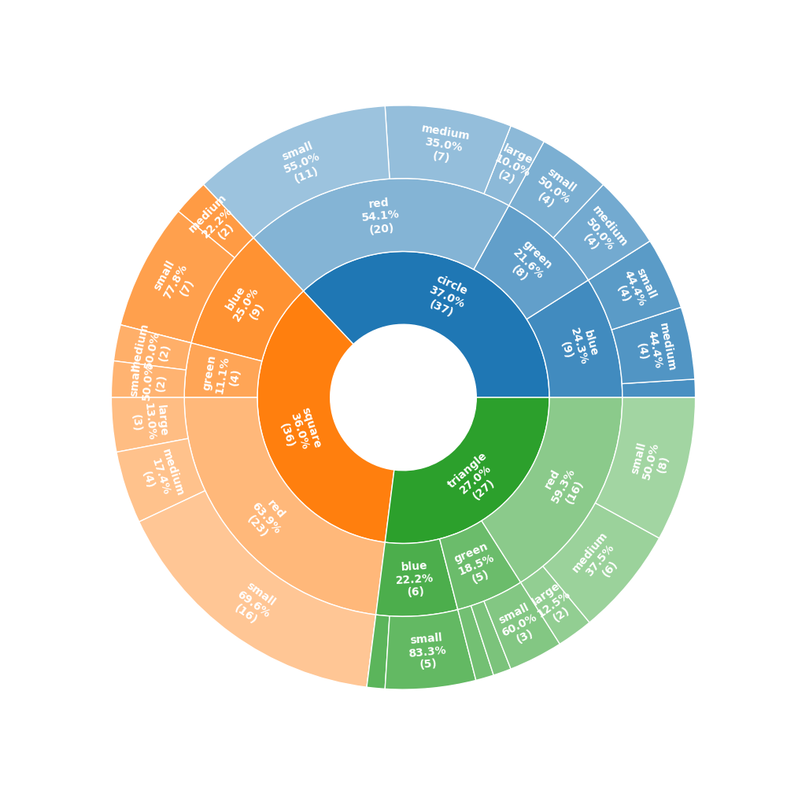

# Description
OnionRings is a python package to automate the plotting of nested pie charts, a.k.a, "onion rings." The package was inspired by the nested pie charts example provided by matplotlib [here](https://matplotlib.org/stable/gallery/pie_and_polar_charts/nested_pie.html).

Onion rings help visualize nested slices of data. OnionRings automates the creation of these nested pie charts and is made especially convenient in conjunction with pandas dataframes.

# Installation

After downloading the code, install the package in your environment using

      pip install .

# Usage
The following example is available as a jupyter notebook in `tests/Examples.ipynb`.

    import pandas as pd
    from onion_rings.onion_rings import plot_onion_rings
    import numpy as np
    
    dictionary = {'Color': np.random.choice(['red','blue','green'],100,p=[0.5,0.3,0.2]), 
                  'Shape': np.random.choice(['triangle','circle','square'],100),
                  'Size': np.random.choice(['small','medium','large'],100,p=[0.6,0.3,0.1])
                 }
    dataframe = pd.DataFrame(dictionary)
    
    plot_onion_rings(dataframe,['Shape','Color','Size'],plot_threshold=0.01,fontsize=10,rel_percent=True);

The resulting plot is a nested pie chart as shown earlier.

The package OnionRings provides two functions whose usage should be self-explanatory.

	def plot_onion_rings(data,labels,shortlabels=None, basecolormap="tab10",plot_threshold = 0.02,fontsize=7,figsize=(10,10),rel_percent=False):
	    """
	    Plots onion rings based on hierachical data represented by a balanced tree
	    Unbalanced tree will be handled in future versions
	    
	   :param data: nested list in which each level of nesting corresponds to a node/leaf in the tree.
	                only the leafs should be populated, the numbers are automatically aggregated, OR
	                a pandas dataframe, in which case the function pandas_to_onion is called to convert it to the appropriate format
	   :param labels: nested list containing the labels to be used at each level, OR
	                  a list of strings, in which case the function pandas_to_onion is called to convert it to the appropriate format.
	                  The list of string is assumed to be the list of columns of the dataframe and used  with pandas groupby to generate the data
	    :param basecolormap (optional): base colors to be used to plot the data (default is "tab10") see https://matplotlib.org/stable/users/explain/colors/colormaps.html
	    :param plot_threshold (optional): threshold (percentage, e.g. 0.02) below which labels are not included (default is 0.02)
	    :param fontsize (optional): fontsize of the labels (default is 7)
	    :param figsize (optional): size of the figure (default is (10,10))
	    :param rel_percent (optional): if True, the labels will be expressed in terms of relative percentage of the total (default is False)
	    
	    Example: tree of depth three with two leaves in each branch (8 leaves total)
	      data = [[[1,3],[1,1]],[[4,5],[1,1]]]
	      labels = [['L11','L12'],['L21','L22'],['L31','L32']]
	
	      plot_onion_rings(data,labels)
	
	    Example: using a pandas dataframe
	      plot_onion_rings(pandas_df,['ColInd1','ColInd2','ColInd3']) #where pandas_df is a pandas dataframe and ColInd1, ColInd2, ColInd3 are the columns to be used as slices. Slice labels will be the unique values of each column.
	    """
	
	def pandas_to_onion(df,slices,slicelabels=None):
	    """
	    Converts a pandas dataframe to a format that can be used by the plot_onion_rings function
	    :param df: dataframe to be converted
	    :param slices: Ordered list of columns to be used as slices
	    :param slicelabels: Optional list of lists of labels to be used for each slice. If not provided, the unique values of each slice will be used
	    :return: a tuple containing the counts and the labels
	    """

# Authors
Matthieu Bloch

Samuel Coogan

# License
MIT License

Copyright (c) 2023 Matthieu Bloch and Samuel Coogan

Permission is hereby granted, free of charge, to any person obtaining a copy
of this software and associated documentation files (the "Software"), to deal
in the Software without restriction, including without limitation the rights
to use, copy, modify, merge, publish, distribute, sublicense, and/or sell
copies of the Software, and to permit persons to whom the Software is
furnished to do so, subject to the following conditions:

The above copyright notice and this permission notice shall be included in all
copies or substantial portions of the Software.

THE SOFTWARE IS PROVIDED "AS IS", WITHOUT WARRANTY OF ANY KIND, EXPRESS OR
IMPLIED, INCLUDING BUT NOT LIMITED TO THE WARRANTIES OF MERCHANTABILITY,
FITNESS FOR A PARTICULAR PURPOSE AND NONINFRINGEMENT. IN NO EVENT SHALL THE
AUTHORS OR COPYRIGHT HOLDERS BE LIABLE FOR ANY CLAIM, DAMAGES OR OTHER
LIABILITY, WHETHER IN AN ACTION OF CONTRACT, TORT OR OTHERWISE, ARISING FROM,
OUT OF OR IN CONNECTION WITH THE SOFTWARE OR THE USE OR OTHER DEALINGS IN THE
SOFTWARE.

# Project status
Onion rings is working as intended, no significant further development is planned.
